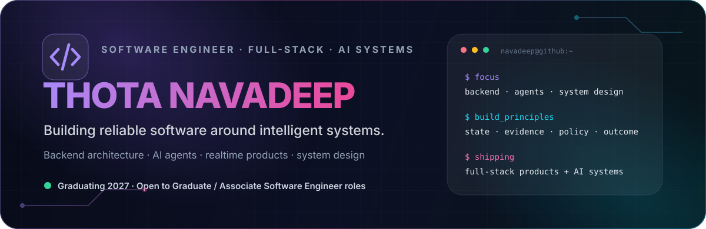
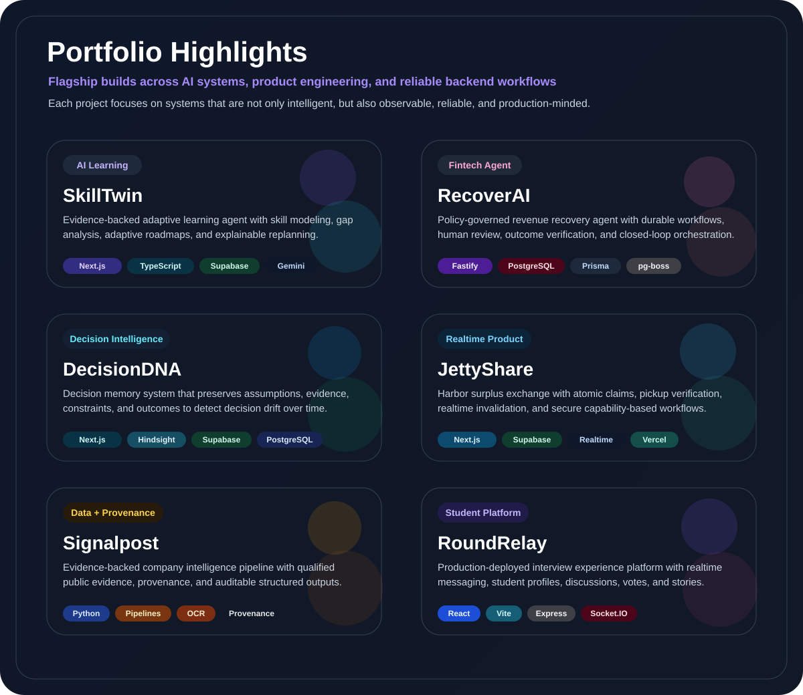

<div align="center">



<br/>

<a href="https://git.io/typing-svg">
  
</a>

<br/>

<a href="https://github.com/navadeep-17"></a>
<a href="#-portfolio-highlights"></a>
<a href="https://skilltwin-production.up.railway.app"></a>
<a href="https://RoundRelay.vercel.app"></a>

<br/><br/>


</div>

---

## ⚡ About Me

```text
> final-year engineering student
> software engineer in the making
> full-stack product builder
> interested in systems where AI has memory, state, policy and evidence
> currently sharpening DSA + CS fundamentals + backend/system design
```

I like building software where **the hard part is not just getting an AI model to answer** — it is making the whole product reliable: persistence, authorization, validation, deterministic guardrails, observability, concurrency, deployment, and measurable outcomes.

> 🏆 **Amazon ML Challenge 2026 — Rank 1325 among 10,000+ teams that submitted.**

---

## 🧰 Tech Arsenal

<div align="center">
  
  <br/>
  
</div>

<br/>

<div align="center">

`REST APIs` · `Realtime Systems` · `LLM Integration` · `Agentic Workflows` · `Structured Outputs` · `CI/CD` · `Testing` · `System Design`

</div>

---

## 🎨 Portfolio Highlights

<div align="center">



<br/>

<a href="https://github.com/navadeep-17/SkillTwin"></a>
<a href="https://github.com/navadeep-17/RecoverAI"></a>
<a href="https://github.com/navadeep-17/decisionDNA"></a>
<a href="https://github.com/navadeep-17/JettyShare"></a>
<a href="https://github.com/navadeep-17/signal-post"></a>
<a href="https://github.com/navadeep-17/InterviewExperience"></a>

</div>

---

## 🚀 Featured Builds

<table>
<tr>
<td width="50%" valign="top">

### 🧠 SkillTwin

**Evidence-backed adaptive learning agent**

Builds a living learner model, identifies role-specific skill gaps, generates adaptive roadmaps, validates progress, and explains why plans change.

**Stack:** Next.js · TypeScript · Supabase · PostgreSQL · Gemini · React Flow

[**Repository ↗**](https://github.com/navadeep-17/SkillTwin) · [**Live App ↗**](https://skilltwin-production.up.railway.app)

</td>
<td width="50%" valign="top">

### 💳 RecoverAI

**Policy-governed revenue recovery agent**

Closed-loop orchestration with deterministic safety policy, durable workflows, human review, outcome verification, concurrency controls, and auditability.

**Stack:** TypeScript · Fastify · PostgreSQL · Prisma · pg-boss · React · Gemini

[**Repository ↗**](https://github.com/navadeep-17/RecoverAI)

</td>
</tr>
<tr>
<td width="50%" valign="top">

### 🧬 DecisionDNA

**Organizational decision-memory system**

Remembers what was decided, why it was decided, and the evidence behind it — then detects when later events invalidate the original assumptions.

**Stack:** Next.js · TypeScript · Hindsight · Supabase · PostgreSQL

[**Repository ↗**](https://github.com/navadeep-17/decisionDNA)

</td>
<td width="50%" valign="top">

### ⚓ JettyShare

**Realtime harbor surplus exchange**

Atomic claims, claim-bound pickup verification, capability-based authorization, realtime invalidation, and concurrency-safe lifecycle transitions.

**Stack:** Next.js · TypeScript · Supabase · PostgreSQL · Realtime · Vercel

[**Repository ↗**](https://github.com/navadeep-17/JettyShare) · [**Live App ↗**](https://jettyshare.vercel.app)

</td>
</tr>
<tr>
<td width="50%" valign="top">

### 🔎 Signalpost

**Evidence-backed company intelligence pipeline**

Resolves company identities, gathers qualified public evidence, preserves provenance, and emits auditable structured intelligence without inventing missing facts.

**Stack:** Python · Data Pipelines · OCR · Evidence Systems

[**Repository ↗**](https://github.com/navadeep-17/signal-post)

</td>
<td width="50%" valign="top">

### 🎯 RoundRelay

**Production-deployed interview experience platform**

Students share recruitment journeys, discuss interview rounds, explore peer profiles, and communicate through realtime direct and department messaging.

**Stack:** React · Vite · Node.js · Express · MongoDB · Socket.IO

[**Repository ↗**](https://github.com/navadeep-17/InterviewExperience) · [**Live App ↗**](https://RoundRelay.vercel.app)

</td>
</tr>
</table>

---

## 📊 GitHub Analytics

<div align="center">


<br/>


</div>

---

## 🐍 Contribution Trail

<div align="center">

<picture>
  <source media="(prefers-color-scheme: dark)" srcset="https://raw.githubusercontent.com/navadeep-17/navadeep-17/output/github-contribution-grid-snake-dark.svg" />
  <source media="(prefers-color-scheme: light)" srcset="https://raw.githubusercontent.com/navadeep-17/navadeep-17/output/github-contribution-grid-snake.svg" />
  
</picture>

</div>

---

## 🧩 What I Like Engineering

<div align="center">


</div>

---

<div align="center">

### `state + evidence + policy → reliable software`

<sub>Building products that can explain what they did, why they did it, and what happened next.</sub>

<br/><br/>


</div>